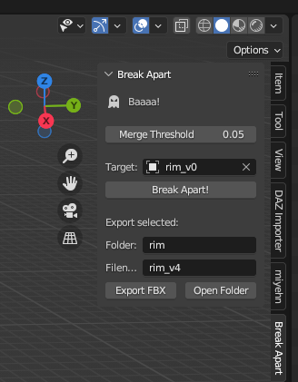

[Latest version download](addons/break_apart.py)

Last updated: 7/30/23

## Merge threshold

It's the threshold used for when you press shift + S to merge vertices by distance.

## Break Apart

Once the addon is installed,

 - set the object to break apart as "Target",
 - select the cookie cutter object,
 - hit the "break apart" button.

[Example video](media/break.mp4)

Btw [here](media/boulder_cutter.fbx) is a boulder mesh I made.

## Export FBX

To be documented

## Hotkeys

These are actions I use a lot when modeling. Let me know if you'd like to add something else.

 - shift + B: break apart
 - shift + L: select linked
 - shift + M: select non-manifold (need to be in vertex or edge editing mode)
 - shift + N: toggle face orientation overlay
 - shift + T: triangulate selected faces
 - shift + V: merge (vertices) at last
 - shift + S: merge by distance with specified threshold

## Contact

Find me on discord (`miyehn`) if you need help or would like to provide feedback.
